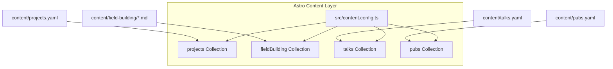

# Design Spec: Site Modernization (Tailwind v4, Astro Content Layer, and Modularity)

## Goal

Modernize the website architecture to fully leverage Astro v6 and Tailwind v4, making the repository content-driven, DRY, highly modular, and performant.

Specifically, we want to:
1. Migrate direct YAML and Markdown file parsing to **Astro Content Collections (Content Layer)**.
2. Centralize duplicate formatting and parsing logic (dates, Markdown links, authors) into a **unified utility module**.
3. Extract the massive client-side scripting (~370 lines) from `Projects.astro` into a **modular, type-safe TypeScript script**.
4. Optimize image loading performance with Astro's native `<Image />` component.
5. Ensure the existing regression test suite remains **100% green** by maintaining expected structural signatures.

---

## Proposed Architecture

### 1. Astro Content Collections Layer
We will create a centralized `src/content.config.ts` configuration mapping all structured content under `content/` with strict Zod validation schemas.



* **Collection 1: `projects`**: YAML data loaded via `file({ path: 'content/projects.yaml' })` representing a list of projects.
* **Collection 2: `fieldBuilding`**: Markdown files loaded via `glob({ pattern: '*.md', base: 'content/field-building' })` representing field-building activities.
* **Collection 3: `talks`**: YAML data loaded via `file({ path: 'content/talks.yaml' })`.
* **Collection 4: `pubs`**: YAML data loaded via `file({ path: 'content/pubs.yaml' })`.

### 2. DRY Utilities (`src/utils/formatters.ts`)
We will create a single, clean module containing pure, tested functions to format dates, parse inline Markdown links, and format/highlight names in author lists:

* `formatDate(dateStr: string): string` — Converts ISO dates Safely to `D MMMM YYYY` (e.g. `2026-05-05` -> `5 May 2026`).
* `formatMonthYear(dateStr: string): string` — Formats starting and ending dates for field-building activities (e.g., `2023-10` -> `October 2023`, `ongoing` -> `Ongoing`).
* `parseMarkdownLinks(text: string): string` — Safely parses markdown links `[text](url)` to HTML anchors with classes matching theme aesthetics.
* `formatAuthors(authors: string[], owner: string): string` — Formats and bolds the owner's name inside the list of publication authors.

### 3. Modular Client Script (`src/scripts/projects.ts`)
The current script tag in `Projects.astro` is ~370 lines of client-side JavaScript. We will extract this into `src/scripts/projects.ts`:
* Expose modular classes/interfaces for filters and sorting state.
* Maintain expected callback/wrapper bindings (e.g., `restoreFromUrl`, `setupPillGroup`) inside `Projects.astro` so that the exact regex assertions in `tests/visual-redesign.test.mjs` remain completely green.

---

## Detailed Component Plan

### `src/content.config.ts` [NEW]
* Define and export collections.
* Set schemas to align with content fields:
  * `projects`: strict categories and roles, array validation for tools and languages.
  * `fieldBuilding`: parsing required date strings, roles, and headlines.
  * `talks`: topic categorizations, date tracking.
  * `pubs`: key roles and formatted URLs.

### `src/utils/formatters.ts` [NEW]
* Clean, TypeScript-enforced utility functions.
* Share date translation routines to avoid code duplication.

### `src/scripts/projects.ts` [NEW]
* Client-side scripting for filtering, multi-selecting, sorting, dropdown toggling, keyboard escapes, and synchronizing filter settings to/from the URL.

### `src/components/Projects.astro` [MODIFY]
* Load content via Astro's `getCollection('projects')`.
* Clean up frontmatter imports.
* Maintain lightweight script wrappers delegating to our TypeScript module.

### `src/components/Publications.astro` [MODIFY]
* Load content via Astro's `getCollection('pubs')` and extract the owner name dynamically from metadata.
* Import unified `formatAuthors` helper.

### `src/components/Talks.astro` [MODIFY]
* Load content via Astro's `getCollection('talks')`.
* Import unified date and link formatting helpers.

### `src/components/FieldBuilding.astro` [MODIFY]
* Load content via Astro's `getCollection('fieldBuilding')`.
* Import unified date formatting helper.

---

## Verification Plan

### 1. Automated Regression Suite
We will run:
```bash
pnpm test
```
to verify that all 11 existing tests stay green.

### 2. Manual Verification
* Run the local development server: `pnpm dev`.
* Test sorting, filters, search, and URL synchronization on the Projects page.
* Verify dark/light toggle and persistent state behaviors.
